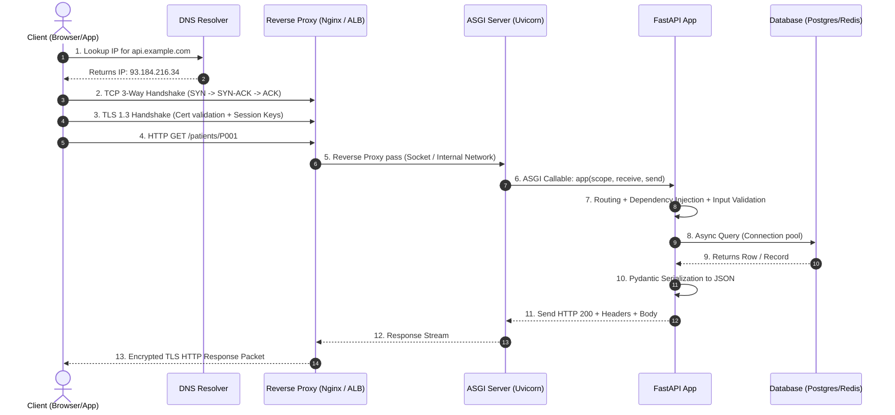

# Comprehensive FastAPI & Backend Engineering Notes

A structured, production-grade guide to modern backend engineering, networking fundamentals, and the FastAPI framework.

```
+------------------------------------------------------------------------------------------+
|                               FASTAPI & BACKEND CURRICULUM                               |
+------------------------------------------------------------------------------------------+
|  Level 1: Fundamentals (Modules 01 - 04)                                                 |
|  - Web Foundations, CGI/WSGI/ASGI, GET & Route Matching, Path/Query & Pydantic Schemas   |
+------------------------------------------------------------------------------------------+
|  Level 2: REST CRUD & API Design Standards (Modules 05 - 07)                             |
|  - Deep-Dive: POST, PUT, PATCH, DELETE (Idempotency & Semantics)                         |
|  - Enterprise URI Naming & Modular APIRouter                                             |
|  - Response Engineering, Generic Envelopes & Global Exception Handlers                   |
+------------------------------------------------------------------------------------------+
|  Level 3: Concurrency & Persistence (Modules 08 - 09)                                    |
|  - Python Event Loop, def vs. async def, and Manual Threadpool Offloading                |
|  - Asynchronous Relational DBs (SQLAlchemy 2.0, AsyncSession, Alembic Migrations)        |
+------------------------------------------------------------------------------------------+
|  Level 4: Security & Production Hardening (Modules 10 - 11)                              |
|  - Bcrypt Hashing, OAuth2 + JWT Auth, RBAC, Safe CORS, and Rate Limiting (SlowAPI)       |
|  - 3-Tier Layered Architecture, pydantic-settings, Correlation ID Middleware & Health    |
+------------------------------------------------------------------------------------------+
|  Level 5: AI/ML Engineering Serving (Module 12)                                          |
|  - Lifespan Model Management, Non-Blocking Forward Passes, Multi-Modal Inputs, Job Queues|
+------------------------------------------------------------------------------------------+

```

> **Modular Topic Guides**:
> - [Module 01: Web & Backend Foundations](topics/01_web_and_backend_foundations.md) (Topics 1–5: What is FastAPI, APIs, Analogy, Needs, Architectures & Networking)
> - [Module 02: Architecture & Gateways](topics/02_architecture_and_gateways.md) (Topics 6–10: Speed, CGI/WSGI/ASGI, Flask vs. FastAPI, Django comparison, Trade-offs)
> - [Module 03: Endpoints & REST CRUD](topics/03_fastapi_endpoints_and_crud.md) (Topics 11–13: GET syntax, HTTP methods, Status codes, CRUD, Dynamic routes)
> - [Module 04: Parameters & Pydantic](topics/04_parameters_and_pydantic.md) (Topics 14–16: Path validation, Query parameters, Request body, Pydantic BaseModel)
> - [Module 05: REST CRUD Deep Dive](topics/05_rest_crud_deep_dive.md) (Topic 17: POST, PUT, PATCH, DELETE with standalone examples)
> - [Module 06: API Naming & Routing Standards](topics/06_api_naming_and_routing_standards.md) (Topic 18: Professional URI design, action verbs, versioning, APIRouter)
> - [Module 07: Response Engineering](topics/07_response_engineering_and_status_codes.md) (Topic 19: response_model filtering, standard envelopes, exception handlers, streaming)
> - [Module 08: Async & Concurrency Deep Dive](topics/08_async_await_concurrency_deep_dive.md) (Topic 20: Event loop, def vs async def, threadpool offloading, asyncio.gather)
> - [Module 09: Database Integration (SQLAlchemy 2.0)](topics/09_database_integration_sqlalchemy.md) (Topic 21: Async engine, session DI, schemas vs models, full CRUD, Alembic)
> - [Module 10: Security & Hardening](topics/10_security_authentication_authorization.md) (Topic 22: Bcrypt, OAuth2 JWT, RBAC, CORS middleware, rate limiting)
> - [Module 11: Upgrading APIs to Production](topics/11_upgrading_apis_to_production.md) (Topic 23: 3-tier architecture, pydantic-settings, logging, middleware, testing, health checks)
> - [Module 12: FastAPI for Machine Learning](topics/12_fastapi_for_machine_learning.md) (Topic 24: Lifespan loading, PyTorch non-blocking inference, image/tabular inputs, task queues)

---

## Table of Contents

- [1. What is FastAPI?](#1-what-is-fastapi)
- [2. What are Web APIs?](#2-what-are-web-apis)
- [3. Real-World API Analogy](#3-real-world-api-analogy)
- [4. The Need for APIs](#4-the-need-for-apis)
- [5. Backend Architectures, Networking & The Request Lifecycle](#5-backend-architectures-networking--the-request-lifecycle)
  - [5.1 Types of Backend Architectures](#51-types-of-backend-architectures)
  - [5.2 End-to-End Internet Request Lifecycle](#52-end-to-end-internet-request-lifecycle)
- [6. Why FastAPI is Fast](#6-why-fastapi-is-fast)
- [7. Evolution of Server Gateway Interfaces (CGI -> WSGI -> ASGI)](#7-evolution-of-server-gateway-interfaces-cgi---wsgi---asgi)
- [8. Deep Dive: Flask (WSGI) vs. FastAPI (ASGI)](#8-deep-dive-flask-wsgi-vs-fastapi-asgi)
- [9. Framework Comparison: Flask vs. FastAPI vs. Django](#9-framework-comparison-flask-vs-fastapi-vs-django)
- [10. Advantages & Disadvantages of FastAPI](#10-advantages--disadvantages-of-fastapi)
- [11. Creating Endpoints & Basic GET Syntax](#11-creating-endpoints--basic-get-syntax)
- [12. HTTP Methods, Semantic Status Codes & RESTful CRUD](#12-http-methods-semantic-status-codes--restful-crud)
- [13. Dynamic API Endpoints & Route Matching](#13-dynamic-api-endpoints--route-matching)
- [14. Using `Path()` for Validation & Metadata](#14-using-path-for-validation--metadata)
- [15. Using `Query()` for Filtering, Sorting & Pagination](#15-using-query-for-filtering-sorting--pagination)
- [16. Working with POST, Request Bodies & Pydantic](#16-working-with-post-request-bodies--pydantic)
- [17. Deep Dive: REST CRUD Operations (POST, PUT, PATCH, DELETE)](#17-deep-dive-rest-crud-operations-post-put-patch-delete)
  - [17.1 POST: Resource Creation](#171-post-resource-creation)
  - [17.2 PUT: Complete Resource Replacement](#172-put-complete-resource-replacement)
  - [17.3 PATCH: Partial Resource Update](#173-patch-partial-resource-update)
  - [17.4 DELETE: Resource Deletion](#174-delete-resource-deletion)
- [18. Professional API Naming Conventions & URL Design](#18-professional-api-naming-conventions--url-design)
  - [18.1 Standard Route Mappings Across Major Situations](#181-standard-route-mappings-across-major-situations)
  - [18.2 API Versioning Strategies](#182-api-versioning-strategies)
  - [18.3 Modular Routing with `APIRouter`](#183-modular-routing-with-apirouter)
- [19. Returning Responses the Professional Way](#19-returning-responses-the-professional-way)
  - [19.1 Using `response_model` to Filter Sensitive Data](#191-using-response_model-to-filter-sensitive-data)
  - [19.2 Standardized JSON Response Envelope](#192-standardized-json-response-envelope)
  - [19.3 Global Exception Handlers for Unified Errors](#193-global-exception-handlers-for-unified-errors)
  - [19.4 Streaming Responses & File Downloads](#194-streaming-responses--file-downloads)
- [20. Asynchronous Python & Concurrency in FastAPI](#20-asynchronous-python--concurrency-in-fastapi)
  - [20.1 `def` vs. `async def` in FastAPI](#201-def-vs-async-def-in-fastapi)
  - [20.2 What Happens When You Block the Event Loop](#202-what-happens-when-you-block-the-event-loop)
  - [20.3 How to Offload Blocking Tasks Manually](#203-how-to-offload-blocking-tasks-manually)
  - [20.4 Parallel Concurrency with `asyncio.gather`](#204-parallel-concurrency-with-asynciogather)
- [21. Merging FastAPI with a Database (SQLAlchemy 2.0 Async)](#21-merging-fastapi-with-a-database-sqlalchemy-20-async)
  - [21.1 Setting Up the Async Database Engine & Session](#211-setting-up-the-async-database-engine--session)
  - [21.2 Defining the ORM Model & Pydantic Schemas](#212-defining-the-orm-model--pydantic-schemas)
  - [21.3 Complete, Production CRUD Operations](#213-complete-production-crud-operations)
  - [21.4 Database Migrations with Alembic](#214-database-migrations-with-alembic)
- [22. Security, Authentication & Production Hardening](#22-security-authentication--production-hardening)
  - [22.1 Password Hashing with Bcrypt](#221-password-hashing-with-bcrypt)
  - [22.2 OAuth2 with Password Flow & JWT Tokens](#222-oauth2-with-password-flow--jwt-tokens)
  - [22.3 Role-Based Access Control (RBAC)](#223-role-based-access-control-rbac)
  - [22.4 CORS Configuration](#224-cors-configuration)
  - [22.5 Rate Limiting with SlowAPI](#225-rate-limiting-with-slowapi)
- [23. Upgrading APIs: From Prototype to Production](#23-upgrading-apis-from-prototype-to-production)
  - [23.1 Production Architecture: Layered (3-Tier) Pattern](#231-production-architecture-layered-3-tier-pattern)
  - [23.2 Centralized Settings with `pydantic-settings`](#232-centralized-settings-with-pydantic-settings)
  - [23.3 Middleware: Correlation IDs & Request Timing](#233-middleware-correlation-ids--request-timing)
  - [23.4 Automated Testing with `pytest` and `httpx`](#234-automated-testing-with-pytest-and-httpx)
  - [23.5 Production Health & Readiness Probes](#235-production-health--readiness-probes)
- [24. High-Performance APIs for Machine Learning & Deep Learning](#24-high-performance-apis-for-machine-learning--deep-learning)
  - [24.1 Application Lifespan: Loading Models Once](#241-application-lifespan-loading-models-once)
  - [24.2 Non-Blocking Inference with `run_in_threadpool`](#242-non-blocking-inference-with-run_in_threadpool)
  - [24.3 Serving Tabular Data & Features](#243-serving-tabular-data--features)
  - [24.4 Handling Long-Running Inference: Asynchronous Task Queues](#244-handling-long-running-inference-asynchronous-task-queues)

---

## 1. What is FastAPI?

**FastAPI** is a modern, high-performance web framework for building APIs with Python 3.8+ based on standard Python type hints.

It is built directly on top of two battle-tested foundational libraries:
1. **Starlette**: Handles the underlying web routing, HTTP requests/responses, WebSockets, background tasks, and ASGI middleware.
2. **Pydantic**: Handles data parsing, runtime schema validation, data serialization, and automatic documentation generation.

```
+-----------------------------------------------------------+
|                         FastAPI                           |
|  (Dependency Injection, Auto Docs, OpenAPI, Routing Meta) |
+-----------------------------+-----------------------------+
|          Starlette          |          Pydantic           |
|    (ASGI Core, Web/HTTP)    |   (Data Validation & Rust)  |
+-----------------------------+-----------------------------+
```

### Why AI/ML Engineers Rely on FastAPI
- **Native Asynchronous I/O (`async`/`await`)**: Allows single-process services to handle thousands of concurrent requests while waiting on database queries, vector index lookups, or downstream model inference calls.
- **Strict Data Contracts**: Machine learning pipelines require deterministic input shapes and types (e.g., verifying feature vectors, batch dimensions, and token limits). Pydantic enforces this at the HTTP boundary.
- **Industry Standard**: Frameworks like Hugging Face, TorchServe, vLLM, LangChain, and Ray Serve expose their HTTP endpoints natively using FastAPI.

---

## 2. What are Web APIs?

An **API (Application Programming Interface)** is a formalized software contract that defines how two distinct computing entities communicate without needing to know each other's internal implementation details.

A **Web API** specifically operates over standard network protocols (primarily **HTTP/HTTPS**):
- The **Client** sends a structured HTTP **Request** (specifying method, URL path, query params, headers, and payload).
- The **Server** processes the request, interacts with databases or compute engines, and returns a structured HTTP **Response** (containing status code, headers, and usually a JSON payload).

```
+------------+       HTTP Request (JSON / Headers)      +------------+
|            | ---------------------------------------> |            |
|   Client   |                                          |   Server   |
| (Web/App)  | <--------------------------------------- | (Backend)  |
+------------+       HTTP Response (Status / Data)      +------------+
```

### Contract-First Boundary
APIs establish boundary isolation:
- The internal database schema can change, but as long as the API response schema remains constant, client applications do not break.
- Complex backend logic (e.g., PyTorch inference, caching layers, SQL queries) is abstracted behind a single predictable URL endpoint.

---

## 3. Real-World API Analogy

### The Restaurant Analogy

| Restaurant Component | Backend / API Equivalent | Technical Function |
| :--- | :--- | :--- |
| **Customer** | **Client (Browser / Mobile / Script)** | Initiates requests and renders data for end users. |
| **Menu** | **API Documentation / OpenAPI Specification** | Lists available endpoints, required parameters, and response schemas. |
| **Waiter** | **API (FastAPI Application Layer)** | Transports requests from client to kitchen, validates order, returns food. |
| **Kitchen / Chef** | **Business Logic / Application Server** | Processes business logic, executes algorithms, runs ML inference. |
| **Pantry / Refrigerator** | **Database / Cache (PostgreSQL, Redis)** | Persistent or in-memory data storage accessed securely by the server. |

> **Key Takeaway**: Customers never walk directly into the kitchen or take raw ingredients from the pantry. Similarly, clients never directly query production databases; they communicate strictly through the API boundary.

---

## 4. The Need for APIs

1. **Decoupling & Separation of Concerns**: Frontends deal exclusively with presentation and user experience; backends deal exclusively with business logic, data persistence, and security.
2. **Multi-Platform Support**: A single FastAPI backend can simultaneously power a React web app, a Flutter mobile app, an IoT sensor, and third-party partner integrations.
3. **Independent Scalability**: You can scale CPU-heavy backend workers across multiple nodes (e.g., Kubernetes pods) without touching the client codebase.
4. **Security & Least Privilege**: The backend ensures clients cannot execute arbitrary SQL queries, directly alter table balances, or bypass authentication/authorization gates.
5. **Microservice Composition**: Allows breaking large software systems into modular, independently deployable services (e.g., Auth Service, Payment Service, Inference Service).

---

## 5. Backend Architectures, Networking & The Request Lifecycle

### 5.1 Types of Backend Architectures

#### 1. Integrated / Server-Rendered Monolithic (SSR)
In this traditional model, the server generates the full HTML page on every request using template engines (e.g., Django Templates, Flask Jinja2, Ruby on Rails, Laravel).

```
monolith_project/
├── app/
│   ├── models/            # Database ORM models
│   ├── views/             # Handlers that query DB and render HTML
│   ├── templates/         # HTML files with Jinja2/Django tags
│   │   ├── base.html
│   │   └── patients.html
│   └── static/            # Raw CSS, client-side JS, images
│       ├── css/style.css
│       └── js/main.js
├── config.py
└── wsgi.py
```
- **Pros**: Simple initial mental model; excellent out-of-the-box SEO.
- **Cons**: High server CPU overhead (rendering HTML strings); cannot natively serve mobile apps or external integrations without building separate endpoints.

#### 2. Decoupled / API-Driven Architecture
The backend is completely headless, exposing pure JSON/Protobuf endpoints. The frontend is a standalone Single Page Application (SPA), mobile app, or external microservice.

```
fastapi_project/
├── app/
│   ├── api/
│   │   └── v1/
│   │       ├── endpoints/
│   │       │   ├── auth.py
│   │       │   └── patients.py    # Route handlers returning JSON
│   │       └── router.py
│   ├── core/
│   │   ├── config.py              # Environment variables & settings
│   │   └── security.py            # Password hashing, JWT auth
│   ├── db/
│   │   ├── base.py
│   │   └── session.py             # Database engine & connection pool
│   ├── models/                    # SQLAlchemy / Tortoise ORM models
│   ├── schemas/                   # Pydantic schemas (Request/Response DTOs)
│   ├── services/                  # Core business logic / ML model runner
│   └── main.py                    # FastAPI instance & middleware
├── tests/
├── .env                           # Environment configuration (secrets)
├── .gitignore
├── Dockerfile
└── requirements.txt
```
- **Pros**: Clean code separation, reusable endpoints across all client types, independent CI/CD deployments, minimal payload size over the wire.
- **Cons**: Requires managing CORS; SEO requires Static Site Generation (SSG) or client-side hydration (e.g., Next.js).

---

### 5.2 End-to-End Internet Request Lifecycle

When a client requests `https://api.example.com/patients/P001`, the request travels through multiple networking layers:



#### Step-by-Step Breakdown:
1. **URL Parsing & DNS Resolution**: The client parses the protocol (`https`), host (`api.example.com`), and path. It checks browser cache -> OS cache -> recursive resolver -> Authoritative DNS server to resolve the domain to an IPv4/IPv6 address.
2. **TCP 3-Way Handshake (Layer 4)**: A reliable transport connection is established via `SYN` -> `SYN-ACK` -> `ACK`.
3. **TLS/SSL Handshake (Security)**: The client and server agree on cipher suites, authenticate the server's TLS certificate, and derive symmetric session encryption keys.
4. **HTTP Request Transmission**: The client writes the serialized HTTP stream (Method, Path, Headers, Body).
5. **Reverse Proxy / Load Balancer (Nginx / Cloudflare / AWS ALB)**: Terminates TLS, shields internal servers, handles rate limiting, and forwards the raw request to the application server.
6. **ASGI Server (Uvicorn)**: Parses the raw byte stream into an ASGI scope dictionary and passes it to the FastAPI application.
7. **FastAPI Processing Pipeline**:
   - Matches the path `/patients/{patient_id}` using Starlette's route trie.
   - Executes middleware (CORS, timing, logging).
   - Validates the path parameter via Pydantic.
   - Executes dependency injection providers (e.g., getting a DB session).
   - Runs the route handler function.
8. **Database / IO Interaction**: The app queries the database asynchronously without blocking the event loop.
9. **Serialization & Response Dispatch**: Pydantic converts the Python model/dict into JSON bytes, wraps it in an ASGI response message, and streams it back through Uvicorn -> Nginx -> Client.

---

## 6. Why FastAPI is Fast

FastAPI is consistently ranked among the fastest Python web frameworks, approaching Go and Node.js performance in independent benchmarks (like TechEmpower).

### Core Architectural Pillars of Performance

1. **Starlette ASGI Engine**:
   - Written from scratch for high-throughput, non-blocking asynchronous operations.
   - Minimal overhead routing and request dispatching.

2. **Pydantic v2 (Rust Core)**:
   - In Pydantic v2, all core validation, JSON parsing, and schema generation logic were rewritten in **Rust** (`pydantic-core`).
   - This provides a **5x to 20x speedup** in parsing and serialization over pure-Python libraries (like Marshmallow or Pydantic v1).

3. **Uvicorn + `uvloop`**:
   - Uvicorn runs Python's `asyncio` code on top of **`uvloop`** (a C-based drop-in replacement for the default asyncio event loop built on `libuv`—the exact C library powering Node.js).
   - Near C-level speed for event loop scheduling and socket polling.

4. **Non-Blocking Asynchronous Concurrency**:
   - Instead of allocating an entire operating system thread per request (which consumes 8MB+ stack memory and triggers expensive OS context switches), an `async` event loop multiplexes thousands of open connections on a single thread.

---

## 7. Evolution of Server Gateway Interfaces (CGI -> WSGI -> ASGI)

Python web frameworks cannot speak raw network sockets directly; they rely on a standardized gateway interface between the web server and the application.

```
[ Web Server ] <---- Interface Specification ----> [ Python Application ]
(Nginx/Apache)      (CGI / WSGI / ASGI)             (Flask / FastAPI)
```

### 1. CGI (Common Gateway Interface) — *The Legacy Era (1990s)*
- **Mechanism**: For *every incoming HTTP request*, the web server spawned a completely new operating system process to run the Python script.
- **Problem**: Process creation is expensive in CPU and memory. Handling 1,000 requests meant spawning 1,000 OS processes, rapidly crashing the server.

### 2. WSGI (Web Server Gateway Interface - PEP 3333) — *The Synchronous Era (2003)*
- **Mechanism**: Keeps long-running worker processes alive. The server invokes a synchronous Python callable:
  ```python
  def application(environ, start_response):
      status = '200 OK'
      headers = [('Content-Type', 'text/plain')]
      start_response(status, headers)
      return [b"Hello World"]
  ```
- **Implementations**: Frameworks like **Flask** and **Django**; servers like **Gunicorn** and **uWSGI**.
- **Limitation**: **Strictly synchronous**. Each worker thread can only handle one request at a time. If an endpoint waits 2 seconds for a database query or an OpenAI API response, that worker is completely blocked. It cannot natively support WebSockets, HTTP/2 multiplexing, or long-polling.

### 3. ASGI (Asynchronous Server Gateway Interface) — *The Modern Era (2018+)*
- **Mechanism**: The asynchronous successor to WSGI. Supports standard `async`/`await` syntax:
  ```python
  async def application(scope, receive, send):
      # scope: metadata dictionary (path, headers, method)
      # receive: awaitable callable to get request body chunks
      # send: awaitable callable to stream response back to server
      ...
  ```
- **Implementations**: Frameworks like **FastAPI** and **Starlette**; servers like **Uvicorn** and **Hypercorn**.
- **Advantage**: A single worker process can handle thousands of concurrent idle or I/O-waiting connections without thread starvation. Natively supports WebSockets and HTTP/2.

### Comparison Matrix

| Feature | CGI | WSGI (PEP 3333) | ASGI |
| :--- | :--- | :--- | :--- |
| **Execution Model** | 1 Process per Request | 1 Thread/Process per Request | Event Loop (Single Thread / Many Concurrencies) |
| **I/O Handling** | Blocking | Blocking | Non-blocking (`asyncio`) |
| **Protocols** | HTTP/1.0 | HTTP/1.1 | HTTP/1.1, HTTP/2, WebSockets |
| **Concurrency Scale** | Very Low (< 10) | Moderate (10s - 100s) | High (10,000+) |
| **Standard Servers** | Apache `mod_cgi` | Gunicorn, uWSGI | Uvicorn, Hypercorn, Daphne |
| **Representative Frameworks**| Raw scripts | Flask, Django (< 3.0) | FastAPI, Starlette, Django Channels |

---

## 8. Deep Dive: Flask (WSGI) vs. FastAPI (ASGI)

```
        FLASK (WSGI Stack)                          FASTAPI (ASGI Stack)

   +--------------------------+                 +--------------------------+
   |  Client (HTTP Request)   |                 |  Client (HTTP Request)   |
   +--------------------------+                 +--------------------------+
                |                                            |
                v                                            v
   +--------------------------+                 +--------------------------+
   |   Gunicorn (WSGI Server) |                 |   Uvicorn (ASGI Server)  |
   +--------------------------+                 +--------------------------+
                |                                            |
                v                                            v
   +--------------------------+                 +--------------------------+
   |  Werkzeug (WSGI Engine)  |                 | Starlette (ASGI Engine)  |
   +--------------------------+                 +--------------------------+
                |                                            |
                v                                            v
   +--------------------------+                 +--------------------------+
   |    Flask Application     |                 |   FastAPI Application    |
   | (Sync Handler Functions) |                 |  (Pydantic + Async/Sync) |
   +--------------------------+                 +--------------------------+
```

### How FastAPI Handles `def` vs. `async def`

A common misconception is that all FastAPI endpoints must be defined with `async def`. FastAPI handles them with distinct internal execution strategies:

1. **`async def` endpoints**:
   - Run directly on the **main event loop**.
   - Must **never** execute blocking code (e.g., `time.sleep()`, standard `requests.get()`, or synchronous database drivers like standard `psycopg2`).
   - If you block inside an `async def` function, you stall the entire event loop for every other concurrent user.

2. **Standard `def` endpoints**:
   - FastAPI automatically detects that the function is synchronous.
   - It routes the execution to an external **worker threadpool** managed by Starlette (`starlette.concurrency.run_in_threadpool`).
   - The main event loop remains free to accept incoming network packets while the blocking function runs in a background thread.

```python
# CORRECT: Non-blocking async call
@app.get("/async-data")
async def get_async_data():
    data = await async_db_client.fetch()  # Non-blocking
    return data

# CORRECT: Blocking code inside standard def
@app.get("/sync-data")
def get_sync_data():
    time.sleep(2)  # Safely executed in a separate threadpool by FastAPI!
    return {"status": "done"}

# ANTI-PATTERN: Blocking code inside async def
@app.get("/bad-practice")
async def bad_practice():
    time.sleep(2)  # FREEZES THE ENTIRE SERVER FOR ALL USERS!
    return {"status": "terrible"}
```

---

## 9. Framework Comparison: Flask vs. FastAPI vs. Django

| Feature | Flask | FastAPI | Django |
| :--- | :--- | :--- | :--- |
| **Architecture** | Micro-framework (WSGI) | Micro/API-framework (ASGI) | Batteries-Included Monolith (WSGI/ASGI) |
| **Core Libraries** | Werkzeug + Jinja2 | Starlette + Pydantic | Proprietary ORM, Forms, Admin, Templating |
| **Typing & Validation** | Manual / Third-party (Marshmallow) | Native Type Hints + Pydantic (Rust) | Django Forms / DRF Serializers |
| **Documentation** | Manual (Flagger, Swagger tools) | Automatic Interactive OpenAPI (`/docs`, `/redoc`) | Manual or third-party (`drf-spectacular`) |
| **ORM** | None (Bring your own, e.g. SQLAlchemy)| None (Bring your own, e.g. SQLAlchemy, SQLModel)| Native Django ORM (Powerful, sync-centric) |
| **Admin Interface** | None (unless using Flask-Admin) | None (can pair with SQLAdmin) | Built-in, fully featured admin panel |
| **Async Performance** | Poor / Retrofitted | Industry-leading (Native ASGI) | Partial (Views can be async, ORM historically sync)|
| **Best Used For** | Small utilities, quick prototypes, SSR apps | High-throughput APIs, ML microservices | Large content sites, ERP systems, full monoliths |

---

## 10. Advantages & Disadvantages of FastAPI

### Advantages
- **Automatic Documentation**: Exposes interactive **Swagger UI** (`/docs`) and **ReDoc** (`/redoc`) with zero manual configuration.
- **Type Safety & IDE Autocomplete**: Eliminates typos in payload keys; your IDE auto-completes fields, types, and nested schemas.
- **Input Validation & Sanitization**: Rejects invalid payloads automatically at the boundary, returning clean, standardized `422 Unprocessable Entity` responses.
- **Dependency Injection System**: Powerful, composable `Depends()` mechanism for managing database sessions, authentication, and permission checks.
- **OpenAPI & JSON Schema Compliance**: Client SDKs (in TypeScript, Dart, Kotlin) can be generated automatically from the schema.

### Disadvantages / Trade-offs
- **No Built-in ORM or Admin**: Unlike Django, you must choose, configure, and maintain your own database layer (SQLAlchemy, Alembic migrations).
- **Async Pitfalls**: Requires understanding Python's asynchronous event loop. Calling synchronous blocking code inside `async def` degrades performance without obvious syntax errors.
- **Ecosystem Maturity**: While large, it is younger than Django's 20-year ecosystem; fewer off-the-shelf plugins exist.

---

## 11. Creating Endpoints & Basic GET Syntax

### Minimal Application Setup

```python
# main.py
from fastapi import FastAPI, status

# 1. Instantiate the application
app = FastAPI(
    title="Patient Management System",
    description="Production-grade API for managing hospital patient records",
    version="1.0.0"
)

# 2. Define a root endpoint using the @app.get decorator
@app.get("/", status_code=status.HTTP_200_OK, tags=["General"])
def read_root() -> dict[str, str]:
    """
    Root health-check endpoint.
    Returns a welcome message.
    """
    return {"status": "healthy", "service": "patient-management"}

@app.get("/about", status_code=status.HTTP_200_OK, tags=["General"])
async def read_about() -> dict[str, str]:
    return {"version": "1.0.0", "author": "Engineering Team"}
```

### Running the Server
FastAPI applications are executed using an ASGI web server such as **Uvicorn**:

```bash
uvicorn main:app --host 127.0.0.1 --port 8000 --reload
```
- `main`: Refers to the Python file `main.py`.
- `app`: Refers to the `FastAPI()` instance created inside `main.py`.
- `--reload`: Enables hot-reloading during development whenever code changes.

Once running, access:
- Application: `http://127.0.0.1:8000/`
- Interactive Swagger UI: `http://127.0.0.1:8000/docs`
- ReDoc UI: `http://127.0.0.1:8000/redoc`

---

## 12. HTTP Methods, Semantic Status Codes & RESTful CRUD

### 12.1 HTTP Methods (Verbs)

| Verb | Operation | Primary Use Case | Safe? | Idempotent? |
| :--- | :--- | :--- | :--- | :--- |
| **GET** | Read | Retrieve resource representations without altering state. | **Yes** | **Yes** |
| **POST** | Create | Submit data to create a new resource or trigger an action. | No | No |
| **PUT** | Replace | Completely replace an existing resource with the request body. | No | **Yes** |
| **PATCH**| Update | Partially modify specific fields of an existing resource. | No | No / Contextual |
| **DELETE**| Delete | Remove an existing resource. | No | **Yes** |

> **Idempotence**: An operation is idempotent if performing it once produces the exact same server side-effects as performing it multiple identical times (e.g., deleting an item 5 times results in the item being deleted).

---

### 12.2 Semantic HTTP Status Codes

FastAPI provides constants in `fastapi.status` to avoid hardcoding "magic numbers":

```python
from fastapi import status
```

- **2xx Success**:
  - `status.HTTP_200_OK`: Standard success response for `GET`, `PUT`, or `PATCH`.
  - `status.HTTP_201_CREATED`: Resource successfully created (standard for `POST`).
  - `status.HTTP_204_NO_CONTENT`: Request succeeded, but there is no body to return (standard for `DELETE`).
- **3xx Redirection**:
  - `status.HTTP_301_MOVED_PERMANENTLY`: Resource URL has permanently changed.
  - `status.HTTP_307_TEMPORARY_REDIRECT`: Preserve the request method across redirect.
- **4xx Client Error** (Client sent bad data or lacks permission):
  - `status.HTTP_400_BAD_REQUEST`: Generic client error or malformed request.
  - `status.HTTP_401_UNAUTHORIZED`: Authentication is required (missing or invalid token).
  - `status.HTTP_403_FORBIDDEN`: Authenticated, but lacks permission for the resource.
  - `status.HTTP_404_NOT_FOUND`: Resource does not exist.
  - `status.HTTP_409_CONFLICT`: Resource already exists (e.g., duplicate email/ID).
  - `status.HTTP_422_UNPROCESSABLE_ENTITY`: Schema validation error generated automatically by FastAPI when types/constraints fail.
- **5xx Server Error** (Backend bug or infrastructure failure):
  - `status.HTTP_500_INTERNAL_SERVER_ERROR`: Unhandled exception in application code.
  - `status.HTTP_502_BAD_GATEWAY`: Reverse proxy received an invalid response from upstream.
  - `status.HTTP_503_SERVICE_UNAVAILABLE`: Server overloaded or undergoing maintenance.

---

### 12.3 What is CRUD?

**CRUD** is an acronym for the four basic persistent storage operations:
- **C**reate -> `POST /patients`
- **R**ead -> `GET /patients/{id}` or `GET /patients`
- **U**pdate -> `PUT /patients/{id}` (full) or `PATCH /patients/{id}` (partial)
- **D**elete -> `DELETE /patients/{id}`

---

## 13. Dynamic API Endpoints & Route Matching

Dynamic routes extract variable path segments enclosed in curly braces `{}`.

```python
from fastapi import FastAPI, HTTPException, status

app = FastAPI()

# In-memory mock database
PATIENT_DB = {
    "P001": {"name": "Alice Johnson", "age": 29},
    "P002": {"name": "Bob Smith", "age": 42}
}

@app.get("/patients/{patient_id}")
def get_patient(patient_id: str):
    if patient_id not in PATIENT_DB:
        # Notice parameter is 'detail', NOT 'detials'
        raise HTTPException(
            status_code=status.HTTP_404_NOT_FOUND,
            detail=f"Patient with ID '{patient_id}' not found."
        )
    return PATIENT_DB[patient_id]
```

### Route Order Precedence (Crucial Rule)
FastAPI matches routes in the **exact order they are declared in code**.

```python
# 1. Specific static route MUST come first:
@app.get("/patients/me")
def get_current_patient_profile():
    return {"profile": "Current logged-in patient"}

# 2. General parameterized route MUST come second:
@app.get("/patients/{patient_id}")
def get_patient_by_id(patient_id: str):
    return {"patient_id": patient_id}
```
*If `/patients/{patient_id}` were declared first, a request to `/patients/me` would match it, interpreting `"me"` as a `patient_id`!*

---

## 14. Using `Path()` for Validation & Metadata

`Path()` is imported from `fastapi` and is used to attach validation rules, metadata, and constraints to path parameters.

### Syntax & Available Constraints

```python
from fastapi import FastAPI, Path, status

app = FastAPI()

@app.get("/patients/{patient_id}", status_code=status.HTTP_200_OK)
def get_patient_details(
    patient_id: str = Path(
        ...,  # '...' indicates the parameter is required
        title="Patient Identifier",
        description="The unique alphanumeric ID of the patient (e.g. P001)",
        pattern=r"^P\d{3}$",     # Regex: Must start with 'P' followed by 3 digits
        examples=["P001", "P099"]
    )
):
    return {"patient_id": patient_id}
```

### Numeric Path Validation
For numeric parameters, use comparison constraints:
- `gt`: Greater than
- `ge`: Greater than or equal to
- `lt`: Less than
- `le`: Less than or equal to

```python
@app.get("/departments/{dept_id}/wards/{ward_number}")
def get_ward(
    dept_id: int = Path(..., ge=1, le=50, description="Department ID between 1 and 50"),
    ward_number: int = Path(..., gt=0, lt=1000, description="Ward number between 1 and 999")
):
    return {"dept_id": dept_id, "ward_number": ward_number}
```

---

## 15. Using `Query()` for Filtering, Sorting & Pagination

### Difference Between Path and Query Parameters

| Dimension | Path Parameter (`/patients/{id}`) | Query Parameter (`/patients?city=Delhi`) |
| :--- | :--- | :--- |
| **Location** | Part of the URL path itself. | Appended after the `?` delimiter. |
| **Purpose** | Locates a specific, distinct resource. | Modifies, filters, sorts, or paginates a resource collection. |
| **Requirement**| Mandatory (route will not match without it).| Typically optional with sensible defaults. |

### Query Parameter Syntax & URL Structure
```
GET /patients?city=Delhi&sort_by=age&order=desc&limit=10
             ^          ^           ^          ^
             |          +-----------+----------+--> Query pairs separated by '&'
             +--> '?' starts query parameter string
```

### Implementing `Query()` in FastAPI

```python
from typing import Literal
from fastapi import FastAPI, Query, HTTPException, status

app = FastAPI()

@app.get("/patients", status_code=status.HTTP_200_OK)
def list_patients(
    # Optional filter with string length validation
    city: str | None = Query(
        default=None,
        min_length=2,
        max_length=50,
        description="Filter patients by city name"
    ),
    # Required query parameter using '...'
    sort_by: Literal["age", "height", "weight"] = Query(
        ...,
        description="Field to sort results by"
    ),
    # Parameter with a default value
    order: Literal["asc", "desc"] = Query(
        default="asc",
        description="Sort direction"
    ),
    # Pagination parameters with numeric constraints
    limit: int = Query(default=10, ge=1, le=100, description="Items per page"),
    offset: int = Query(default=0, ge=0, description="Number of items to skip")
):
    return {
        "city": city,
        "sort_by": sort_by,
        "order": order,
        "limit": limit,
        "offset": offset
    }
```

### List / Multi-Value Query Parameters
Clients can pass multiple values for the same key: `/patients?tags=icu&tags=critical`:

```python
@app.get("/patients/filter")
def filter_by_tags(
    tags: list[str] = Query(
        default=[],
        description="Provide multiple tags: ?tags=urgent&tags=cardio"
    )
):
    return {"active_filters": tags}
```

---

## 16. Working with POST, Request Bodies & Pydantic

### 16.1 What is an HTTP Request Body?
A request body is the data payload transmitted over HTTP in operations like `POST`, `PUT`, and `PATCH`. While query parameters are visible in the URL bar and server access logs, the request body is sent separately in the HTTP payload and is typically serialized as JSON:

```http
POST /patients HTTP/1.1
Host: api.example.com
Content-Type: application/json

{
    "name": "David Miller",
    "city": "Boston",
    "age": 34,
    "gender": "male",
    "height": 178.5,
    "weight": 76.2
}
```

---

### 16.2 Defining Schemas with Pydantic `BaseModel`

Pydantic validates incoming data at runtime against declared Python types. If data conforms, it parses it into a typed Python object; if invalid, it immediately halts execution and returns a descriptive `422 Unprocessable Entity` response.

```python
from typing import Literal
from pydantic import BaseModel, Field, EmailStr

class PatientCreate(BaseModel):
    name: str = Field(..., min_length=2, max_length=100, examples=["John Doe"])
    email: EmailStr = Field(..., description="Valid communication email")
    city: str = Field(..., min_length=2, max_length=50, examples=["Chicago"])
    age: int = Field(..., gt=0, lt=130, description="Age must be between 1 and 129")
    gender: Literal["male", "female", "other"]
    height_cm: float = Field(..., gt=30.0, lt=280.0, description="Height in centimeters")
    weight_kg: float = Field(..., gt=2.0, lt=500.0, description="Weight in kilograms")
    is_active: bool = Field(default=True, description="Account active status")

class PatientResponse(PatientCreate):
    id: str = Field(..., description="Unique generated system ID")
```

---

### 16.3 Handling POST Requests & Returning `response_model`

The `response_model` argument in route decorators ensures **data filtering and security**: it strips out fields you do not want to leak to clients (such as hashed passwords or internal database flags) and enforces the output contract in documentation.

```python
import uuid
from fastapi import FastAPI, status, HTTPException

app = FastAPI()

# Temporary in-memory datastore
DB: dict[str, dict] = {}

@app.post(
    "/patients",
    response_model=PatientResponse,
    status_code=status.HTTP_201_CREATED,
    tags=["Patients"]
)
def create_patient(payload: PatientCreate):
    """
    Register a new patient.
    - Validates payload against PatientCreate schema.
    - Generates a unique system ID.
    - Stores record in database.
    - Returns serialized PatientResponse.
    """
    # 1. Generate unique identifier
    patient_id = f"P_{uuid.uuid4().hex[:6].upper()}"

    # 2. Convert Pydantic model to dictionary
    patient_record = payload.model_dump()
    patient_record["id"] = patient_id

    # 3. Persist record
    DB[patient_id] = patient_record

    # 4. Return dictionary matching PatientResponse schema
    return patient_record
```

---

### 16.4 Complete, Clean CRUD Implementation Example

Here is a runnable pattern unifying routing, status codes, `Path`, `Query`, and Pydantic validation:

```python
from typing import Literal
import uuid
from fastapi import FastAPI, HTTPException, Path, Query, status
from pydantic import BaseModel, Field

app = FastAPI(title="Complete Patient CRUD")

# ================= SCHEMAS =================
class PatientBase(BaseModel):
    name: str = Field(..., min_length=2, max_length=100)
    age: int = Field(..., gt=0, le=120)
    city: str = Field(..., min_length=2, max_length=50)

class PatientCreate(PatientBase):
    pass

class PatientUpdate(BaseModel):
    name: str | None = Field(default=None, min_length=2, max_length=100)
    age: int | None = Field(default=None, gt=0, le=120)
    city: str | None = Field(default=None, min_length=2, max_length=50)

class PatientOut(PatientBase):
    id: str

# ================= MOCK DB =================
PATIENTS_STORAGE: dict[str, dict] = {}

# ================= ENDPOINTS =================

# 1. CREATE (POST)
@app.post("/patients", response_model=PatientOut, status_code=status.HTTP_201_CREATED)
def create_patient(patient: PatientCreate):
    new_id = f"P{len(PATIENTS_STORAGE) + 1:03d}"
    record = patient.model_dump()
    record["id"] = new_id
    PATIENTS_STORAGE[new_id] = record
    return record

# 2. READ ALL / QUERY (GET)
@app.get("/patients", response_model=list[PatientOut], status_code=status.HTTP_200_OK)
def get_all_patients(
    city: str | None = Query(default=None, description="Filter by city"),
    order: Literal["asc", "desc"] = Query(default="asc", description="Sort order by age")
):
    results = list(PATIENTS_STORAGE.values())
    if city:
        results = [p for p in results if p["city"].lower() == city.lower()]
    
    reverse_flag = (order == "desc")
    results = sorted(results, key=lambda p: p["age"], reverse=reverse_flag)
    return results

# 3. READ ONE / PATH (GET)
@app.get("/patients/{patient_id}", response_model=PatientOut, status_code=status.HTTP_200_OK)
def get_patient_by_id(
    patient_id: str = Path(..., pattern=r"^P\d{3}$", description="Patient ID like P001")
):
    if patient_id not in PATIENTS_STORAGE:
        raise HTTPException(
            status_code=status.HTTP_404_NOT_FOUND,
            detail=f"Patient '{patient_id}' not found."
        )
    return PATIENTS_STORAGE[patient_id]

# 4. PARTIAL UPDATE (PATCH)
@app.patch("/patients/{patient_id}", response_model=PatientOut, status_code=status.HTTP_200_OK)
def update_patient(
    patient_id: str = Path(..., pattern=r"^P\d{3}$"),
    updates: PatientUpdate = ...
):
    if patient_id not in PATIENTS_STORAGE:
        raise HTTPException(status_code=status.HTTP_404_NOT_FOUND, detail="Patient not found.")
    
    stored_data = PATIENTS_STORAGE[patient_id]
    update_data = updates.model_dump(exclude_unset=True)  # Only take explicitly passed fields
    stored_data.update(update_data)
    PATIENTS_STORAGE[patient_id] = stored_data
    return stored_data

# 5. DELETE (DELETE)
@app.delete("/patients/{patient_id}", status_code=status.HTTP_204_NO_CONTENT)
def delete_patient(patient_id: str = Path(..., pattern=r"^P\d{3}$")):
    if patient_id not in PATIENTS_STORAGE:
        raise HTTPException(status_code=status.HTTP_404_NOT_FOUND, detail="Patient not found.")
    del PATIENTS_STORAGE[patient_id]
    return None

---

## 17. Deep Dive: REST CRUD Operations (POST, PUT, PATCH, DELETE)

In REST architectures, data mutations are governed by standard HTTP verbs. Understanding the semantic differences between `POST`, `PUT`, `PATCH`, and `DELETE` prevents subtle API design bugs.

### Summary Comparison Table

| HTTP Verb | Operation | Idempotent? | Safe? | Typical Success Status | Request Body? |
| :--- | :--- | :--- | :--- | :--- | :--- |
| **POST** | Create resource / Action | **No** (calling $N$ times creates $N$ records) | No | `201 Created` | **Yes** |
| **PUT** | Complete replacement | **Yes** (calling $N$ times leaves identical state) | No | `200 OK` or `204 No Content` | **Yes** (full entity) |
| **PATCH**| Partial update | **No** (contextual; e.g. append operations) | No | `200 OK` | **Yes** (subset of fields) |
| **DELETE**| Removal of resource | **Yes** (resource stays deleted after first call) | No | `204 No Content` or `200 OK` | Optional (typically No) |

---

### 17.1 POST: Resource Creation

`POST` is used to create a new subordinate resource under a collection URI (e.g. `POST /patients`), or to submit processing commands that have side effects.

#### Semantic Rules for POST
1. **Non-Idempotent**: Submitting the same `POST /patients` request twice with identical data creates two distinct records with different IDs, unless uniqueness constraints trigger `409 Conflict`.
2. **Status Code**: Return `201 Created` upon successful generation.
3. **Location Header**: In strict REST, return a `Location` response header indicating the URI of the newly created entity (e.g., `Location: /patients/P003`).

#### Complete POST Example

```python
from fastapi import FastAPI, Response, status
from pydantic import BaseModel, Field

app = FastAPI(title="POST Example")

PATIENT_DB: dict[str, dict] = {}

class PatientCreate(BaseModel):
    name: str = Field(..., min_length=2, max_length=100, examples=["Ananya Roy"])
    age: int = Field(..., gt=0, le=120, examples=[29])
    diagnosis: str = Field(..., min_length=3, max_length=200, examples=["Hypertension"])

class PatientOut(PatientCreate):
    id: str

@app.post(
    "/patients",
    response_model=PatientOut,
    status_code=status.HTTP_201_CREATED,
    summary="Create a new patient record"
)
def create_patient(payload: PatientCreate, response: Response):
    # 1. Generate unique server-side identifier
    patient_id = f"P{len(PATIENT_DB) + 1:03d}"

    # 2. Serialize Pydantic payload to dictionary and attach ID
    new_patient = payload.model_dump()
    new_patient["id"] = patient_id

    # 3. Store record in database
    PATIENT_DB[patient_id] = new_patient

    # 4. Set Location header pointing to the created resource
    response.headers["Location"] = f"/patients/{patient_id}"

    return new_patient
```

---

### 17.2 PUT: Complete Resource Replacement

`PUT` replaces the **entire representation** of a target resource at the specified URI.

#### Semantic Rules for PUT
1. **Full Representation**: The client must send all required fields for the entity. Any field omitted by the client is reset to its default value or cleared.
2. **Idempotency**: Executing `PUT /patients/P001` once has the exact same side-effect as executing it 100 times.
3. **PUT vs. PATCH**:
   - `PUT`: *"Replace this entire patient object with this new payload."*
   - `PATCH`: *"Update only the patient's phone number; leave everything else untouched."*

#### Complete PUT Example

```python
from fastapi import FastAPI, HTTPException, Path, status
from pydantic import BaseModel, Field

app = FastAPI(title="PUT Example")

PATIENT_DB: dict[str, dict] = {
    "P001": {"id": "P001", "name": "Rahul Verma", "age": 30, "city": "Delhi"}
}

class PatientPutSchema(BaseModel):
    """Full replacement schema: every field is mandatory."""
    name: str = Field(..., min_length=2, max_length=100)
    age: int = Field(..., gt=0, le=120)
    city: str = Field(..., min_length=2, max_length=50)

class PatientOut(PatientPutSchema):
    id: str

@app.put(
    "/patients/{patient_id}",
    response_model=PatientOut,
    status_code=status.HTTP_200_OK,
    summary="Completely replace patient record"
)
def replace_patient(
    patient_id: str = Path(..., pattern=r"^P\d{3}$"),
    payload: PatientPutSchema = ...
):
    if patient_id not in PATIENT_DB:
        raise HTTPException(
            status_code=status.HTTP_404_NOT_FOUND,
            detail=f"Patient with ID '{patient_id}' not found."
        )

    # Completely overwrite existing record (preserving unchanged primary key)
    updated_record = payload.model_dump()
    updated_record["id"] = patient_id
    PATIENT_DB[patient_id] = updated_record

    return updated_record
```

---

### 17.3 PATCH: Partial Resource Update

When you only need to change one or two fields of an entity (e.g. updating a patient's city without re-sending their name and age), use `PATCH`.

#### Key FastAPI Pattern: `model_dump(exclude_unset=True)`
If a client sends `{"city": "Pune"}`, Pydantic's default `model_dump()` would include `name=None, age=None`, inadvertently wiping out existing fields.
By passing `exclude_unset=True`, Pydantic only extracts fields that were **explicitly sent** in the incoming JSON request.

```python
from fastapi import FastAPI, HTTPException, Path, status
from pydantic import BaseModel, Field

app = FastAPI(title="PATCH Example")

PATIENT_DB: dict[str, dict] = {
    "P001": {"id": "P001", "name": "Rahul Verma", "age": 30, "city": "Delhi"}
}

class PatientPatchSchema(BaseModel):
    name: str | None = Field(default=None, min_length=2, max_length=100)
    age: int | None = Field(default=None, gt=0, le=120)
    city: str | None = Field(default=None, min_length=2, max_length=50)

class PatientOut(BaseModel):
    id: str
    name: str
    age: int
    city: str

@app.patch(
    "/patients/{patient_id}",
    response_model=PatientOut,
    status_code=status.HTTP_200_OK,
    summary="Partially update patient fields"
)
def patch_patient(
    patient_id: str = Path(..., pattern=r"^P\d{3}$"),
    payload: PatientPatchSchema = ...
):
    if patient_id not in PATIENT_DB:
        raise HTTPException(
            status_code=status.HTTP_404_NOT_FOUND,
            detail=f"Patient '{patient_id}' not found."
        )

    # Extract only the fields supplied by client
    update_data = payload.model_dump(exclude_unset=True)

    if not update_data:
        raise HTTPException(
            status_code=status.HTTP_400_BAD_REQUEST,
            detail="Request body cannot be empty for PATCH update."
        )

    # Mutate existing stored entity
    record = PATIENT_DB[patient_id]
    record.update(update_data)
    PATIENT_DB[patient_id] = record

    return record
```

---

### 17.4 DELETE: Resource Deletion

`DELETE` removes the resource targeted by the request URI.

#### Semantic Rules for DELETE
1. **Idempotent**: Calling `DELETE /patients/P001` once deletes the record. Calling it again leaves the system in a state where the record does not exist.
2. **Status Code**:
   - `204 No Content`: The standard RESTful return code when no response body is sent.
   - `200 OK`: Used if returning confirmation metadata like `{"message": "Patient deleted"}`.

#### Complete DELETE Example

```python
from fastapi import FastAPI, HTTPException, Path, Response, status

app = FastAPI(title="DELETE Example")

PATIENT_DB: dict[str, dict] = {
    "P001": {"id": "P001", "name": "Rahul Verma", "age": 30, "city": "Delhi"},
    "P002": {"id": "P002", "name": "Sara Khan", "age": 25, "city": "Mumbai"},
}

@app.delete(
    "/patients/{patient_id}",
    status_code=status.HTTP_204_NO_CONTENT,
    summary="Delete a patient (returns 204)"
)
def delete_patient(patient_id: str = Path(..., pattern=r"^P\d{3}$")):
    if patient_id not in PATIENT_DB:
        raise HTTPException(
            status_code=status.HTTP_404_NOT_FOUND,
            detail=f"Patient '{patient_id}' does not exist."
        )

    del PATIENT_DB[patient_id]
    return Response(status_code=status.HTTP_204_NO_CONTENT)
```

---

## 18. Professional API Naming Conventions & URL Design

### Core Principles

| Principle | Correct Pattern | Anti-Pattern | Reason |
| :--- | :--- | :--- | :--- |
| **Use Nouns, Not Verbs** | `GET /patients` | `GET /getPatients` | The HTTP method (`GET`) is already the verb. |
| **Use Plural Resources** | `GET /patients`, `POST /patients` | `GET /patient` | Endpoint represents a collection of resources. |
| **Lowercase & Hyphens** | `GET /medical-records` | `GET /medical_records`, `/medicalRecords` | URLs are case-insensitive on some proxies; kebab-case is web standard. |
| **Consistent Sub-Resources** | `GET /patients/{id}/appointments` | `GET /getAppointmentsByPatientId` | Reflects true hierarchical data relationships. |
| **No CRUD in Paths** | `DELETE /patients/{id}` | `POST /patients/delete` | HTTP verbs control the mutation. |

---

### 18.1 Standard Route Mappings Across Major Situations

#### 1. Simple Resource Collection & Single Items
```
GET    /api/v1/patients             # Retrieve paginated list of patients
POST   /api/v1/patients             # Create a new patient
GET    /api/v1/patients/{id}        # Retrieve specific patient
PUT    /api/v1/patients/{id}        # Replace full patient record
PATCH  /api/v1/patients/{id}        # Partially update patient
DELETE /api/v1/patients/{id}        # Delete specific patient
```

#### 2. Nested Sub-Resources (Hierarchical Relationships)
```
GET    /api/v1/patients/{patient_id}/prescriptions            # List prescriptions for patient
POST   /api/v1/patients/{patient_id}/prescriptions            # Add prescription to patient
GET    /api/v1/patients/{patient_id}/prescriptions/{presc_id} # Get specific prescription
DELETE /api/v1/patients/{patient_id}/prescriptions/{presc_id} # Delete specific prescription
```

#### 3. Non-CRUD Operations (Actions & Controller Verbs)
When an operation does not fit into standard CRUD, use action verbs under specific sub-resources with `POST`:
```
POST   /api/v1/auth/login                     # User authentication / token generation
POST   /api/v1/appointments/{id}/cancel      # Business state transition
POST   /api/v1/invoices/{id}/pay              # Process payment
POST   /api/v1/models/ecg-classifier/predict  # ML inference trigger
```

---

### 18.2 API Versioning Strategies

Always version your endpoints under the URL path (e.g. `/api/v1/`). This allows introducing `/api/v2/` without breaking deployed mobile apps or legacy integrations.

---

### 18.3 Modular Routing with `APIRouter`

```python
# app/api/v1/endpoints/patients.py
from fastapi import APIRouter, status
from pydantic import BaseModel

router = APIRouter(prefix="/patients", tags=["Patients"])

class PatientSchema(BaseModel):
    name: str
    age: int

@router.get("", status_code=status.HTTP_200_OK)
def list_patients():
    return [{"id": "P001", "name": "Aarav"}]

@router.post("", status_code=status.HTTP_201_CREATED)
def create_patient(payload: PatientSchema):
    return {"id": "P002", **payload.model_dump()}
```

Mount routers cleanly in `main.py`:
```python
# app/main.py
from fastapi import FastAPI
from app.api.v1.endpoints import patients

app = FastAPI(title="Production Healthcare Backend", version="1.0.0")
app.include_router(patients.router, prefix="/api/v1")
```

---

## 19. Returning Responses the Professional Way

### 19.1 Using `response_model` to Filter Sensitive Data

FastAPI's `response_model` strips sensitive internal fields (e.g. `hashed_password`, internal flags) before returning data to the client:

```python
from fastapi import FastAPI
from pydantic import BaseModel, EmailStr

app = FastAPI()

class UserInDB(BaseModel):
    id: str
    username: str
    email: EmailStr
    hashed_password: str
    is_admin: bool

class UserPublic(BaseModel):
    id: str
    username: str
    email: EmailStr

@app.get("/users/me", response_model=UserPublic)
def get_current_user():
    user_db = UserInDB(
        id="usr_123",
        username="prashant",
        email="user@example.com",
        hashed_password="bcrypt$argon_secret_hash",
        is_admin=True
    )
    # FastAPI automatically serializes into UserPublic, removing hashed_password & is_admin
    return user_db
```

---

### 19.2 Standardized JSON Response Envelope

Wrap collections and API payloads in structured envelopes with metadata:

```python
from typing import Generic, TypeVar
from pydantic import BaseModel

T = TypeVar("T")

class StandardResponse(BaseModel, Generic[T]):
    success: bool
    message: str
    data: T | None = None

class PaginatedMeta(BaseModel):
    total_records: int
    page: int
    page_size: int
    total_pages: int

class PaginatedResponse(BaseModel, Generic[T]):
    success: bool
    message: str
    data: list[T]
    meta: PaginatedMeta
```

---

### 19.3 Global Exception Handlers for Unified Errors

Override default validation and business logic exceptions using `@app.exception_handler`:

```python
from fastapi import FastAPI, Request, status
from fastapi.exceptions import RequestValidationError
from fastapi.responses import JSONResponse

app = FastAPI()

@app.exception_handler(RequestValidationError)
async def handle_validation_error(request: Request, exc: RequestValidationError):
    errors = [{"field": ".".join(str(loc) for loc in err["loc"]), "issue": err["msg"]} for err in exc.errors()]
    return JSONResponse(
        status_code=status.HTTP_422_UNPROCESSABLE_ENTITY,
        content={
            "success": False,
            "error_code": "VALIDATION_FAILED",
            "message": "Invalid request parameters or payload.",
            "errors": errors,
            "path": str(request.url.path)
        }
    )
```

---

### 19.4 Streaming Responses & File Downloads

```python
import asyncio
from typing import AsyncGenerator
from fastapi import FastAPI
from fastapi.responses import StreamingResponse

app = FastAPI()

async def token_stream_generator(prompt: str) -> AsyncGenerator[str, None]:
    for word in f"Streaming response tokens for query: {prompt}".split():
        await asyncio.sleep(0.1)
        yield f"data: {word}\n\n"

@app.get("/api/v1/chat/stream")
async def stream_chat(prompt: str):
    return StreamingResponse(token_stream_generator(prompt), media_type="text/event-stream")
```

---

## 20. Asynchronous Python & Concurrency in FastAPI

### 20.1 `def` vs. `async def` in FastAPI

| Declaration | Execution Context | Ideal Use Case | Fatal Risk |
| :--- | :--- | :--- | :--- |
| `async def endpoint()` | Directly on the **main Event Loop** thread | Async libraries (`asyncpg`, `httpx.AsyncClient`, `aiofiles`) | Calling synchronous blocking code (`time.sleep`, `requests.get`, `torch.infer`) freezes all users! |
| `def endpoint()` | In an external **Threadpool** (`starlette.concurrency`) | Synchronous legacy libraries (`requests`, `sqlite3`, heavy NumPy/Torch) | Minor thread context-switching overhead for lightweight I/O. |

---

### 20.2 What Happens When You Block the Event Loop

```python
# DANGEROUS - FREEZES THE ENTIRE SERVER
import time
from fastapi import FastAPI

app = FastAPI()

@app.get("/bad-async")
async def bad_endpoint():
    time.sleep(5)  # Freezes the single event loop thread for 5 seconds
    return {"status": "delayed"}
```

---

### 20.3 How to Offload Blocking Tasks Manually

When you must call a blocking CPU function or synchronous SDK inside an `async def` pipeline, offload it:

```python
import asyncio
import time
from fastapi import FastAPI
from fastapi.concurrency import run_in_threadpool

app = FastAPI()

def blocking_heavy_compute(patient_id: str, n: int) -> dict:
    time.sleep(1)  # Simulates blocking computation
    return {"patient_id": patient_id, "score": sum(i * i for i in range(n))}

@app.get("/process/{patient_id}")
async def process_patient(patient_id: str):
    # Method 1: FastAPI's run_in_threadpool
    result = await run_in_threadpool(blocking_heavy_compute, patient_id, 100_000)
    
    # Method 2: Standard Python asyncio.to_thread
    # result = await asyncio.to_thread(blocking_heavy_compute, patient_id, 100_000)
    
    return {"result": result}
```

---

### 20.4 Parallel Concurrency with `asyncio.gather`

Execute multiple independent async I/O tasks simultaneously:

```python
import asyncio
import httpx
from fastapi import FastAPI

app = FastAPI()

async def fetch_service_a(client: httpx.AsyncClient):
    await asyncio.sleep(0.1)
    return {"service": "A"}

async def fetch_service_b(client: httpx.AsyncClient):
    await asyncio.sleep(0.1)
    return {"service": "B"}

@app.get("/aggregate")
async def aggregate():
    async with httpx.AsyncClient() as client:
        res_a, res_b = await asyncio.gather(
            fetch_service_a(client),
            fetch_service_b(client)
        )
    return {"data": [res_a, res_b]}
```

---

## 21. Merging FastAPI with a Database (SQLAlchemy 2.0 Async)

### 21.1 Setting Up the Async Database Engine & Session

```python
# database.py
from collections.abc import AsyncGenerator
from sqlalchemy.ext.asyncio import AsyncSession, async_sessionmaker, create_async_engine
from sqlalchemy.orm import DeclarativeBase

DATABASE_URL = "sqlite+aiosqlite:///./hospital.db"

engine = create_async_engine(DATABASE_URL, echo=False, future=True)

async_session_factory = async_sessionmaker(
    bind=engine,
    autocommit=False,
    autoflush=False,
    expire_on_commit=False,
    class_=AsyncSession
)

class Base(DeclarativeBase):
    pass

async def get_db() -> AsyncGenerator[AsyncSession, None]:
    async with async_session_factory() as session:
        try:
            yield session
        except Exception:
            await session.rollback()
            raise
        finally:
            await session.close()
```

---

### 21.2 Defining the ORM Model & Pydantic Schemas

```python
# models.py
from datetime import datetime
from sqlalchemy import DateTime, Integer, String, func
from sqlalchemy.orm import Mapped, mapped_column
from database import Base

class Patient(Base):
    __tablename__ = "patients"

    id: Mapped[int] = mapped_column(Integer, primary_key=True, index=True, autoincrement=True)
    name: Mapped[str] = mapped_column(String(100), nullable=False)
    age: Mapped[int] = mapped_column(Integer, nullable=False)
    city: Mapped[str] = mapped_column(String(50), nullable=False)
    diagnosis: Mapped[str] = mapped_column(String(200), nullable=False)
    created_at: Mapped[datetime] = mapped_column(DateTime(timezone=True), server_default=func.now())
```

```python
# schemas.py
from datetime import datetime
from pydantic import BaseModel, ConfigDict, Field

class PatientBase(BaseModel):
    name: str = Field(..., min_length=2, max_length=100)
    age: int = Field(..., gt=0, le=120)
    city: str = Field(..., min_length=2, max_length=50)
    diagnosis: str = Field(..., min_length=2, max_length=200)

class PatientCreate(PatientBase):
    pass

class PatientUpdate(BaseModel):
    name: str | None = Field(default=None, min_length=2, max_length=100)
    age: int | None = Field(default=None, gt=0, le=120)
    city: str | None = Field(default=None, min_length=2, max_length=50)
    diagnosis: str | None = Field(default=None, min_length=2, max_length=200)

class PatientResponse(PatientBase):
    id: int
    created_at: datetime
    model_config = ConfigDict(from_attributes=True)
```

---

### 21.3 Complete, Production CRUD Operations

```python
# main.py
from contextlib import asynccontextmanager
from typing import Annotated
from fastapi import Depends, FastAPI, HTTPException, Query, status
from sqlalchemy import select
from sqlalchemy.ext.asyncio import AsyncSession

from database import Base, engine, get_db
from models import Patient
from schemas import PatientCreate, PatientResponse, PatientUpdate

@asynccontextmanager
async def lifespan(app: FastAPI):
    async with engine.begin() as conn:
        await conn.run_sync(Base.metadata.create_all)
    yield
    await engine.dispose()

app = FastAPI(title="FastAPI + SQLAlchemy 2.0 Async CRUD", lifespan=lifespan)
DbSession = Annotated[AsyncSession, Depends(get_db)]

# CREATE (POST)
@app.post("/api/v1/patients", response_model=PatientResponse, status_code=status.HTTP_201_CREATED)
async def create_patient(payload: PatientCreate, db: DbSession):
    db_patient = Patient(**payload.model_dump())
    db.add(db_patient)
    await db.commit()
    await db.refresh(db_patient)
    return db_patient

# READ ALL / QUERY (GET)
@app.get("/api/v1/patients", response_model=list[PatientResponse])
async def list_patients(
    db: DbSession,
    city: str | None = Query(default=None),
    limit: int = Query(default=10, ge=1, le=100),
    offset: int = Query(default=0, ge=0)
):
    query = select(Patient)
    if city:
        query = query.where(Patient.city.ilike(f"%{city}%"))
    query = query.offset(offset).limit(limit)
    result = await db.execute(query)
    return result.scalars().all()

# READ ONE (GET)
@app.get("/api/v1/patients/{patient_id}", response_model=PatientResponse)
async def get_patient(patient_id: int, db: DbSession):
    query = select(Patient).where(Patient.id == patient_id)
    result = await db.execute(query)
    patient = result.scalar_one_or_none()
    if not patient:
        raise HTTPException(status_code=404, detail="Patient not found.")
    return patient

# PARTIAL UPDATE (PATCH)
@app.patch("/api/v1/patients/{patient_id}", response_model=PatientResponse)
async def update_patient(patient_id: int, payload: PatientUpdate, db: DbSession):
    query = select(Patient).where(Patient.id == patient_id)
    result = await db.execute(query)
    patient = result.scalar_one_or_none()
    if not patient:
        raise HTTPException(status_code=404, detail="Patient not found.")

    for field, value in payload.model_dump(exclude_unset=True).items():
        setattr(patient, field, value)

    await db.commit()
    await db.refresh(patient)
    return patient

# DELETE (DELETE)
@app.delete("/api/v1/patients/{patient_id}", status_code=status.HTTP_204_NO_CONTENT)
async def delete_patient(patient_id: int, db: DbSession):
    query = select(Patient).where(Patient.id == patient_id)
    result = await db.execute(query)
    patient = result.scalar_one_or_none()
    if not patient:
        raise HTTPException(status_code=404, detail="Patient not found.")
    await db.delete(patient)
    await db.commit()
    return None
```

---

### 21.4 Database Migrations with Alembic

In real deployments, schema changes are tracked with **Alembic**:
```bash
alembic init alembic
alembic revision --autogenerate -m "create patients table"
alembic upgrade head
```

---

## 22. Security, Authentication & Production Hardening

### 22.1 Password Hashing with Bcrypt

```python
from passlib.context import CryptContext

pwd_context = CryptContext(schemes=["bcrypt"], deprecated="auto")

def hash_password(password: str) -> str:
    return pwd_context.hash(password)

def verify_password(plain_password: str, hashed_password: str) -> bool:
    return pwd_context.verify(plain_password, hashed_password)
```

---

### 22.2 OAuth2 with Password Flow & JWT Tokens

```python
from datetime import datetime, timedelta, timezone
from typing import Annotated
from fastapi import Depends, FastAPI, HTTPException, status
from fastapi.security import OAuth2PasswordBearer, OAuth2PasswordRequestForm
import jwt
from pydantic import BaseModel

SECRET_KEY = "CHANGE_IN_PRODUCTION_ENV"
ALGORITHM = "HS256"

oauth2_scheme = OAuth2PasswordBearer(tokenUrl="/api/v1/auth/token")
app = FastAPI()

def create_access_token(data: dict, expires_delta: timedelta | None = None) -> str:
    to_encode = data.copy()
    expire = datetime.now(timezone.utc) + (expires_delta or timedelta(minutes=15))
    to_encode.update({"exp": expire})
    return jwt.encode(to_encode, SECRET_KEY, algorithm=ALGORITHM)

async def get_current_user(token: Annotated[str, Depends(oauth2_scheme)]):
    credentials_exception = HTTPException(
        status_code=status.HTTP_401_UNAUTHORIZED,
        detail="Could not validate credentials.",
        headers={"WWW-Authenticate": "Bearer"},
    )
    try:
        payload = jwt.decode(token, SECRET_KEY, algorithms=[ALGORITHM])
        username = payload.get("sub")
        if not username:
            raise credentials_exception
        return {"username": username, "role": payload.get("role")}
    except jwt.PyJWTError:
        raise credentials_exception
```

---

### 22.3 Role-Based Access Control (RBAC)

```python
class RequireRole:
    def __init__(self, allowed_roles: list[str]):
        self.allowed_roles = allowed_roles

    def __call__(self, current_user: Annotated[dict, Depends(get_current_user)]) -> dict:
        if current_user.get("role") not in self.allowed_roles:
            raise HTTPException(
                status_code=status.HTTP_403_FORBIDDEN,
                detail=f"Operation not permitted. Required role: {self.allowed_roles}"
            )
        return current_user

@app.get("/api/v1/admin/records", dependencies=[Depends(RequireRole(["admin"]))])
async def get_admin_records():
    return {"data": "Protected admin records"}
```

---

### 22.4 CORS Configuration

```python
from fastapi.middleware.cors import CORSMiddleware

ALLOWED_ORIGINS = [
    "http://localhost:3000",
    "https://hospital-portal.com"
]

app.add_middleware(
    CORSMiddleware,
    allow_origins=ALLOWED_ORIGINS,
    allow_credentials=True,
    allow_methods=["GET", "POST", "PUT", "PATCH", "DELETE", "OPTIONS"],
    allow_headers=["Authorization", "Content-Type"],
)
```

---

### 22.5 Rate Limiting with SlowAPI

```python
from fastapi import FastAPI, Request
from slowapi import Limiter, _rate_limit_exceeded_handler
from slowapi.util import get_remote_address
from slowapi.errors import RateLimitExceeded

limiter = Limiter(key_func=get_remote_address)
app = FastAPI()
app.state.limiter = limiter
app.add_exception_handler(RateLimitExceeded, _rate_limit_exceeded_handler)

@app.post("/api/v1/auth/login")
@limiter.limit("5/minute")
async def login(request: Request):
    return {"status": "OK"}
```

---

## 23. Upgrading APIs: From Prototype to Production

### 23.1 Production Architecture: Layered (3-Tier) Pattern

```
app/
├── api/v1/endpoints/     # Controllers (HTTP routing, validation)
├── core/                 # Config, security, logging
├── db/                   # Database engine & session
├── models/               # SQLAlchemy ORM models
├── schemas/              # Pydantic data contracts
├── services/             # Core business rules
└── main.py               # App entrypoint & middleware
```

---

### 23.2 Centralized Settings with `pydantic-settings`

```python
# app/core/config.py
from pydantic_settings import BaseSettings, SettingsConfigDict

class Settings(BaseSettings):
    PROJECT_NAME: str = "Healthcare API"
    ENVIRONMENT: str = "production"
    SECRET_KEY: str
    DATABASE_URL: str

    model_config = SettingsConfigDict(env_file=".env")

settings = Settings()
```

---

### 23.3 Middleware: Correlation IDs & Request Timing

```python
import time
import uuid
from fastapi import FastAPI, Request
from starlette.middleware.base import BaseHTTPMiddleware

class ObservabilityMiddleware(BaseHTTPMiddleware):
    async def dispatch(self, request: Request, call_next):
        request_id = request.headers.get("X-Request-ID", str(uuid.uuid4()))
        start_time = time.perf_counter()
        response = await call_next(request)
        process_time_ms = (time.perf_counter() - start_time) * 1000

        response.headers["X-Request-ID"] = request_id
        response.headers["X-Process-Time-Ms"] = f"{process_time_ms:.2f}"
        return response

app = FastAPI()
app.add_middleware(ObservabilityMiddleware)
```

---

### 23.4 Automated Testing with `pytest` and `httpx`

```python
import pytest
from httpx import ASGITransport, AsyncClient
from app.main import app

@pytest.mark.asyncio
async def test_get_patients():
    transport = ASGITransport(app=app)
    async with AsyncClient(transport=transport, base_url="http://test") as client:
        response = await client.get("/api/v1/patients")
        assert response.status_code == 200
```

---

### 23.5 Production Health & Readiness Probes

```python
from fastapi import APIRouter, status
from sqlalchemy import text
from app.db.session import engine

router = APIRouter(tags=["Health"])

@router.get("/health/live", status_code=status.HTTP_200_OK)
async def liveness():
    return {"status": "alive"}

@router.get("/health/ready", status_code=status.HTTP_200_OK)
async def readiness():
    async with engine.connect() as conn:
        await conn.execute(text("SELECT 1"))
    return {"status": "ready", "database": "connected"}
```

---

## 24. High-Performance APIs for Machine Learning & Deep Learning

### 24.1 Application Lifespan: Loading Models Once

Never load weights inside route handlers! Load models during lifespan startup:

```python
from contextlib import asynccontextmanager
from fastapi import FastAPI
import torch
import torchvision.models as models

class ModelContainer:
    def __init__(self):
        self.device = torch.device("cuda" if torch.cuda.is_available() else "cpu")
        self.model = None

    def load(self):
        self.model = models.resnet50(weights=models.ResNet50_Weights.DEFAULT)
        self.model.eval()
        self.model.to(self.device)
        # Warmup
        with torch.no_grad():
            self.model(torch.randn(1, 3, 224, 224, device=self.device))

    def unload(self):
        if self.device.type == "cuda":
            torch.cuda.empty_cache()

container = ModelContainer()

@asynccontextmanager
async def lifespan(app: FastAPI):
    container.load()
    app.state.ml_model = container
    yield
    container.unload()

app = FastAPI(lifespan=lifespan)
```

---

### 24.2 Non-Blocking Inference with `run_in_threadpool`

Offload the CPU/GPU forward pass to a threadpool to prevent freezing the event loop:

```python
import io
from fastapi import FastAPI, File, Request, UploadFile, status
from fastapi.concurrency import run_in_threadpool
from PIL import Image
import torch
import torchvision.transforms as transforms

preprocess = transforms.Compose([
    transforms.Resize(256),
    transforms.CenterCrop(224),
    transforms.ToTensor(),
    transforms.Normalize(mean=[0.485, 0.456, 0.406], std=[0.229, 0.224, 0.225]),
])

def run_inference_sync(image_bytes: bytes, container):
    image = Image.open(io.BytesIO(image_bytes)).convert("RGB")
    tensor = preprocess(image).unsqueeze(0).to(container.device)
    with torch.no_grad():
        logits = container.model(tensor)
        conf, class_id = torch.max(torch.nn.functional.softmax(logits[0], dim=0), dim=0)
    return {"class_id": int(class_id.item()), "confidence": float(conf.item())}

@app.post("/api/v1/predict/vision")
async def predict_vision(request: Request, file: UploadFile = File(...)):
    image_bytes = await file.read()
    container = request.app.state.ml_model
    # Offload blocking inference to threadpool
    result = await run_in_threadpool(run_inference_sync, image_bytes, container)
    return result
```

---

### 24.3 Serving Tabular Data & Features

```python
from fastapi import FastAPI
import numpy as np
from pydantic import BaseModel, Field

app = FastAPI()

class PatientFeatures(BaseModel):
    age: int = Field(..., ge=1, le=120)
    systolic_bp: int = Field(..., ge=50, le=250)
    cholesterol: float = Field(..., ge=50.0, le=500.0)

@app.post("/api/v1/predict/cardiac-risk")
async def predict_cardiac_risk(features: PatientFeatures):
    vector = np.array([[features.age, features.systolic_bp, features.cholesterol]], dtype=np.float32)
    risk_score = float(1 / (1 + np.exp(- (features.age * 0.04 + features.cholesterol * 0.01 - 4.0))))
    return {"risk_probability": round(risk_score, 4), "high_risk": risk_score > 0.65}
```

---

### 24.4 Handling Long-Running Inference: Asynchronous Task Queues

For heavy or multi-second inference, return `202 Accepted` with a Job ID and poll asynchronously:

```python
import uuid
from fastapi import BackgroundTasks, FastAPI, status

app = FastAPI()
JOBS = {}

def process_heavy_model(job_id: str, data: str):
    import time
    time.sleep(5)  # Heavy model inference
    JOBS[job_id] = {"status": "COMPLETED", "result": {"output": "Processed successfully"}}

@app.post("/api/v1/jobs/predict", status_code=status.HTTP_202_ACCEPTED)
async def submit_job(data: str, background_tasks: BackgroundTasks):
    job_id = str(uuid.uuid4())
    JOBS[job_id] = {"status": "PROCESSING"}
    background_tasks.add_task(process_heavy_model, job_id, data)
    return {"job_id": job_id, "status": "PROCESSING"}

@app.get("/api/v1/jobs/predict/{job_id}")
async def get_job(job_id: str):
    return JOBS.get(job_id, {"error": "Job not found"})
```
```