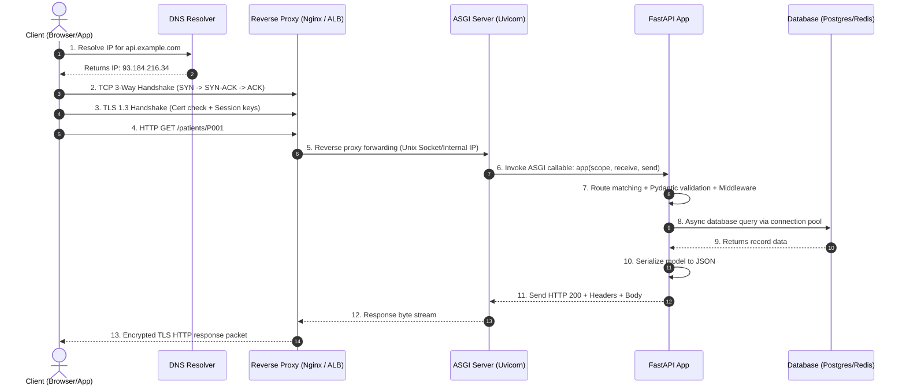

# Module 01: Web & Backend Foundations

A detailed guide to APIs, backend architectures, and the internet networking lifecycle.

---

## 1. What is FastAPI?

**FastAPI** is a modern, high-performance web framework for building APIs with Python 3.8+ based on standard Python type hints.

FastAPI is not built from scratch; it coordinates two foundational libraries:
- **Starlette**: Handles ASGI networking, request dispatching, routing, WebSockets, background tasks, and HTTP middleware.
- **Pydantic**: Handles data parsing, schema validation, serialization, and automatic OpenAPI schema generation using a high-speed Rust core (`pydantic-core`).

```
+-------------------------------------------------------------+
|                          FastAPI                            |
| (Dependency Injection, Routing Metadata, OpenAPI Generation) |
+------------------------------+------------------------------+
|          Starlette           |           Pydantic           |
|      (Web & ASGI Core)       |    (Data Validation/Rust)    |
+------------------------------+------------------------------+
```

### Relevance in AI/ML Engineering
- **Asynchronous Concurrency**: When serving machine learning models, I/O operations (vector database searches in Qdrant/Pinecone, token streaming from LLM providers, database logging) can run concurrently without blocking worker processes.
- **Strict Data Contracts**: Machine learning inference requires deterministic tensor shapes and typed feature maps. Pydantic ensures payloads match expected structures before reaching inference functions.
- **De Facto Standard**: Hugging Face Inference Endpoints, vLLM, TorchServe, LangServe, and Ray Serve expose their HTTP endpoints natively using FastAPI.

---

## 2. What are Web APIs?

An **API (Application Programming Interface)** is a formalized contract defining how separate software components interact without exposing underlying implementation logic.

A **Web API** specifically operates over standard networking protocols (principally **HTTP/HTTPS**):
- **Client**: Issues an HTTP Request (composed of method, URI, headers, parameters, and payload).
- **Server**: Receives the request, processes business logic, and returns an HTTP Response (composed of a status code, response headers, and typically a JSON payload).

### Boundary Isolation
Web APIs act as encapsulation boundaries:
- The internal database schema can be refactored, normalized, or migrated without impacting client applications as long as the API JSON response shape remains stable.
- Complex system internals (e.g., PyTorch inference, database connection pooling, distributed caching) remain concealed behind a clean, predictable URL interface.

---

## 3. Real-World API Analogy

### The Restaurant System

```
[ Customer ]  ---(1. Reads Menu)--------> [ Menu / OpenAPI Spec ]
     |
     +---(2. Places Order)--------------> [ Waiter / FastAPI ]
                                                 |
                                         (3. Sends Ticket)
                                                 v
                                          [ Kitchen / Server Logic ]
                                                 |
                                         (4. Gets Ingredients)
                                                 v
                                          [ Pantry / Database ]
```

| Component | Backend / API Equivalent | Technical Function |
| :--- | :--- | :--- |
| **Customer** | **Client Application (Web / Mobile / CLI)** | Initiates requests and renders data for end users. |
| **Menu** | **API Documentation / OpenAPI Specification** | Defines available endpoints, input parameters, and return formats. |
| **Waiter** | **API Layer (FastAPI Application)** | Validates input against menu rules, transports request to kitchen, returns response. |
| **Kitchen / Chef**| **Application Server / Business Logic** | Executes computational logic, runs algorithms, or prepares data. |
| **Pantry** | **Database / Storage (PostgreSQL, Redis)** | Persistent or cached storage queried exclusively by backend logic. |

> **Rule of Least Privilege**: Customers never walk into the kitchen or take ingredients from the pantry directly. Similarly, clients never connect directly to production databases; all interactions must pass through the API boundary.

---

## 4. The Need for APIs

1. **Decoupled Architecture**: Frontends focus on UX, UI states, and responsive styling; backends focus on data integrity, heavy computation, and security.
2. **Multi-Client Interoperability**: One single backend can power web applications (React/Next.js), native mobile apps (iOS/Android), desktop apps, IoT devices, and external partner integrations.
3. **Independent Scalability**: You can scale CPU-intensive backend workers horizontally (e.g., across Kubernetes pods) independently of frontend asset delivery (which is served from global CDNs).
4. **Security & Data Sanitization**: The API boundary enforces authentication, rate limiting, role-based authorization, and schema sanitization, protecting the internal database from direct exposure.
5. **Microservices & Ecosystem Integration**: Enables assembling complex software architectures by composing independent, specialized services (e.g., Stripe for payments, Auth0 for identity, FastAPI for ML inference).

---

## 5. Backend Architectures & Networking

### 5.1 Integrated Monolith (SSR) vs. Decoupled API-Driven

#### Integrated / Server-Side Rendered (SSR) Monolith
The server dynamically compiles HTML pages on each request using template engines (Django Templates, Flask Jinja2, Ruby on Rails, Laravel).

```
monolith_project/
├── app/
│   ├── models/            # Database ORM models
│   ├── views/             # Handlers that query DB and render HTML
│   ├── templates/         # HTML templates with Jinja2/Django tags
│   │   ├── base.html
│   │   └── patients.html
│   └── static/            # CSS stylesheets, client-side JS, images
│       ├── css/style.css
│       └── js/main.js
├── config.py
└── wsgi.py
```
- **Pros**: Simple monolithic deployment; built-in SEO without client hydration.
- **Cons**: High server CPU utilization spent rendering HTML strings; cannot easily serve mobile applications or third-party API clients.

#### Decoupled / API-Driven Backend
The backend serves strictly headless, structured data (JSON/Protobuf). The frontend is a standalone SPA (React, Vue), mobile application (Flutter, Swift), or external service.

```
fastapi_backend/
├── app/
│   ├── api/
│   │   └── v1/
│   │       ├── endpoints/
│   │       │   ├── auth.py
│   │       │   └── patients.py    # Route handlers returning JSON
│   │       └── router.py
│   ├── core/
│   │   ├── config.py              # Environment variables & pydantic-settings
│   │   └── security.py            # Password hashing, JWT token handling
│   ├── db/
│   │   ├── base.py
│   │   └── session.py             # Database engine & async session pool
│   ├── models/                    # SQLAlchemy / Tortoise ORM models
│   ├── schemas/                   # Pydantic schemas (Request/Response DTOs)
│   ├── services/                  # Business logic / AI inference pipelines
│   └── main.py                    # FastAPI instance & middleware configuration
├── tests/
├── .env                           # Local environment secrets (in .gitignore)
├── Dockerfile
└── requirements.txt
```
- **Pros**: Clean boundary separation; frontend and backend can be maintained by different teams and deployed on independent cadences; minimal payload size over the wire.
- **Cons**: Requires CORS configuration; SEO requires SSR/SSG on the frontend (e.g., Next.js).

---

### 5.2 End-to-End Internet Request Lifecycle

When a client requests `https://api.example.com/patients/P001`:



#### Detailed Network Stages:
1. **URL Parsing & DNS Resolution**: The client extracts scheme (`https`), host (`api.example.com`), and path. It queries browser cache -> OS hosts cache -> recursive resolver -> Root -> TLD -> Authoritative DNS server to resolve the IP address.
2. **TCP 3-Way Handshake (OSI Layer 4)**: The client and server establish a reliable transport-layer connection via `SYN` -> `SYN-ACK` -> `ACK`.
3. **TLS/SSL Handshake (Security)**: Over the TCP stream, client and server negotiate TLS version (typically TLS 1.3), verify the server's certificate, and compute symmetric encryption keys using Diffie-Hellman key exchange.
4. **HTTP Request Delivery**: The client sends the encrypted HTTP payload (Method, URI, Headers like `Authorization`, and Body).
5. **Reverse Proxy / Load Balancer (Nginx / AWS ALB)**: Terminates TLS, shields internal infrastructure, handles rate limiting, and forwards the raw request to the application server over a local network or Unix domain socket.
6. **ASGI Server (Uvicorn)**: Transforms raw bytes into an ASGI `scope` dictionary and invokes the FastAPI application.
7. **FastAPI Processing**:
   - Matches the URL against registered routes.
   - Executes middleware (CORS, authentication, tracing).
   - Validates URL parameters via Pydantic.
   - Invokes dependency injection (`Depends`) to provide database sessions or credentials.
   - Executes the handler function.
8. **Asynchronous I/O**: The server awaits database queries or external API calls without blocking the main event loop.
9. **Serialization & Response Stream**: Pydantic serializes the output dictionary/model into JSON, sets headers (`Content-Type: application/json`), and streams it back through Uvicorn -> Reverse Proxy -> Client.
