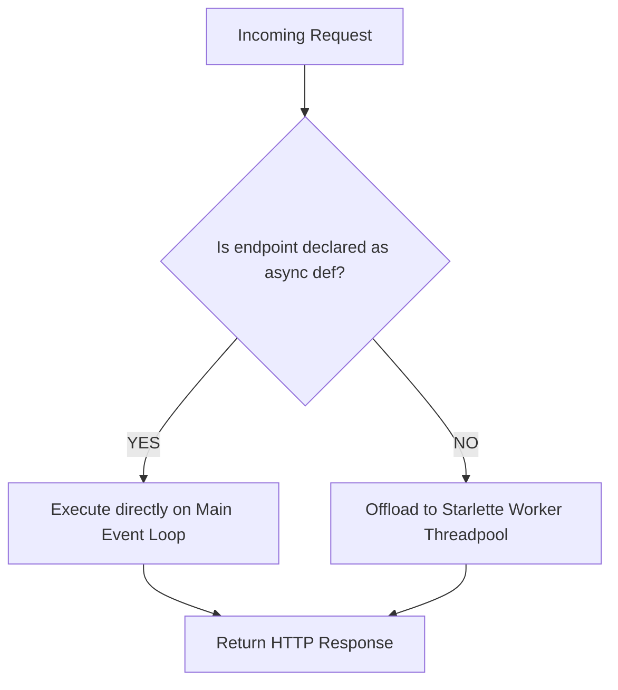

# Module 02: Server Architecture, Gateway Interfaces & Framework Comparisons

A deep dive into why FastAPI is fast, the historical evolution from CGI to ASGI, and how Flask, FastAPI, and Django compare under the hood.

---

## 6. Why FastAPI is Fast

FastAPI ranks among the fastest web frameworks in Python, matching Go and Node.js in high-concurrency benchmarks.

### The Four Performance Engines

```
+--------------------------------------------------------------------+
|                         FastAPI Core Speed                         |
+-------------------+-------------------+----------------------------+
|   Starlette       |   Pydantic v2     |    Uvicorn + uvloop        |
|  (ASGI Routing)   |  (Rust Engine)    |   (C-Based Event Loop)     |
+-------------------+-------------------+----------------------------+
```

1. **Starlette ASGI Engine**:
   - Built specifically for asynchronous Python using ASGI specifications.
   - Extremely minimal routing overhead compared to traditional WSGI frameworks.
2. **Pydantic v2 (Rust Core)**:
   - In Pydantic v2, all core validation, JSON parsing, and schema serialization were rewritten in **Rust** (`pydantic-core`).
   - Parsing and serialization are **5x to 20x faster** than pure-Python equivalents like Marshmallow or Pydantic v1.
3. **Uvicorn + `uvloop`**:
   - `uvloop` is a drop-in replacement for Python's standard `asyncio` event loop.
   - Implemented in Cython on top of **`libuv`** (the high-performance C library powering Node.js).
   - Near C-level scheduling speed for socket I/O.
4. **Non-Blocking Asynchronous Concurrency**:
   - Traditional synchronous servers spawn 1 OS thread per request (consuming ~8MB RAM each and incurring OS context-switch overhead).
   - An asynchronous event loop multiplexes thousands of active connections on a single OS thread.

---

## 7. Evolution of Server Gateway Interfaces (CGI -> WSGI -> ASGI)

Web servers (such as Nginx or Apache) do not natively execute Python code. They require a standardized interface to pass requests to Python applications.

### 1. CGI (Common Gateway Interface) — *The 1990s*
- **Mechanism**: The web server spawns a brand new operating system process for **every incoming HTTP request**.
- **Limitation**: Process creation is CPU and memory expensive. A traffic spike of 500 requests spawns 500 OS processes, rapidly triggering Out-Of-Memory (OOM) crashes.

### 2. WSGI (Web Server Gateway Interface - PEP 3333) — *The 2000s*
- **Mechanism**: Long-running worker processes/threads are pooled and kept alive. The web server passes requests into a synchronous callable:
  ```python
  def application(environ, start_response):
      start_response('200 OK', [('Content-Type', 'text/plain')])
      return [b"Hello, WSGI!"]
  ```
- **Implementations**: Frameworks: **Flask**, **Django** (<3.0); Servers: **Gunicorn**, **uWSGI**.
- **Limitation**: **Strictly synchronous**. Each worker handles exactly one request at a time. If an endpoint makes a 1-second database query, that worker thread is completely blocked. It cannot natively support WebSockets, server-sent events, or HTTP/2 multiplexing.

### 3. ASGI (Asynchronous Server Gateway Interface) — *The Modern Standard*
- **Mechanism**: The asynchronous successor to WSGI. Implemented as an awaitable coroutine function:
  ```python
  async def application(scope, receive, send):
      # scope: Request metadata dictionary
      # receive: Awaitable to read incoming request body chunks
      # send: Awaitable to stream response headers and data back
      ...
  ```
- **Implementations**: Frameworks: **FastAPI**, **Starlette**, **Django Channels**; Servers: **Uvicorn**, **Hypercorn**, **Daphne**.
- **Advantage**: Handles tens of thousands of concurrent idle or I/O-bound connections on a single thread. Supports HTTP/1.1, HTTP/2, and bidirectional WebSockets natively.

### Architecture Comparison Table

| Feature | CGI | WSGI (PEP 3333) | ASGI |
| :--- | :--- | :--- | :--- |
| **Concurrency Model** | 1 Process per Request | 1 Thread/Process per Request | Single-thread Event Loop (`asyncio`) |
| **I/O Strategy** | Blocking | Blocking | Non-blocking |
| **Supported Protocols** | HTTP/1.0 | HTTP/1.1 | HTTP/1.1, HTTP/2, WebSockets |
| **Concurrency Ceiling** | Minimal (< 20) | Moderate (10s to 100s) | Massive (10,000+) |
| **Standard Servers** | Apache `mod_cgi` | Gunicorn, uWSGI | Uvicorn, Hypercorn |
| **Key Frameworks** | Shell / Perl / Old Python | Flask, Classic Django | FastAPI, Starlette, Quart |

---

## 8. Deep Dive: Flask (WSGI) vs. FastAPI (ASGI)

```
        FLASK (WSGI Pipeline)                       FASTAPI (ASGI Pipeline)

   +-----------------------------+              +-----------------------------+
   |   Incoming HTTP Request     |              |   Incoming HTTP Request     |
   +-----------------------------+              +-----------------------------+
                  |                                            |
                  v                                            v
   +-----------------------------+              +-----------------------------+
   |   Gunicorn (WSGI Server)    |              |   Uvicorn (ASGI Server)     |
   +-----------------------------+              +-----------------------------+
                  |                                            |
                  v                                            v
   +-----------------------------+              +-----------------------------+
   |   Werkzeug (Routing Engine) |              |  Starlette (Routing Engine) |
   +-----------------------------+              +-----------------------------+
                  |                                            |
                  v                                            v
   +-----------------------------+              +-----------------------------+
   |      Flask Application      |              |     FastAPI Application     |
   | (Synchronous Worker Thread) |              | (Async Loop / Threadpool)   |
   +-----------------------------+              +-----------------------------+
```

### How FastAPI Handles `def` vs. `async def`

FastAPI routes can be declared using either standard `def` or `async def`. Under the hood, FastAPI executes them differently:



1. **`async def` endpoints**:
   - Run directly on the **main event loop**.
   - **Critical Rule**: You must **never** call blocking functions inside `async def` (e.g., `time.sleep()`, synchronous `requests.get()`, or blocking database drivers like standard `psycopg2`).
   - Blocking inside an `async def` handler freezes the event loop for all concurrent users!
2. **Standard `def` endpoints**:
   - FastAPI automatically detects that the function is synchronous.
   - It offloads the execution to an external **threadpool** managed by Starlette (`starlette.concurrency.run_in_threadpool`).
   - The main event loop remains free to accept incoming network packets while the blocking function runs in a background thread.

```python
import time
import httpx
from fastapi import FastAPI

app = FastAPI()

# CORRECT: Truly async I/O
@app.get("/async-fetch")
async def async_fetch():
    async with httpx.AsyncClient() as client:
        res = await client.get("https://httpbin.org/delay/1")
    return res.json()

# CORRECT: Blocking code inside standard def (FastAPI threadpool handles it)
@app.get("/sync-sleep")
def sync_sleep():
    time.sleep(1)  # Safe: Offloaded to threadpool
    return {"status": "ok"}

# DANGEROUS: Blocking code inside async def (Freezes entire server)
@app.get("/blocking-freeze")
async def blocking_freeze():
    time.sleep(1)  # ANTI-PATTERN: Blocks the entire asyncio event loop!
    return {"status": "bad"}
```

---

## 9. Framework Comparison: Flask vs. FastAPI vs. Django

| Dimension | Flask | FastAPI | Django |
| :--- | :--- | :--- | :--- |
| **Framework Type** | Micro-framework (WSGI) | API Micro-framework (ASGI) | Full-Stack Monolith (WSGI/ASGI) |
| **Foundation** | Werkzeug + Jinja2 | Starlette + Pydantic | Django Core (Custom ORM, Forms, Views)|
| **Type Validation** | Manual (or third-party Marshmallow)| Native Pydantic (Rust core) | Django Forms / DRF Serializers |
| **API Documentation** | Manual setup (Flasgger) | Automatic Swagger UI & ReDoc | Third-party (`drf-spectacular`) |
| **Database ORM** | None (Typically SQLAlchemy) | None (SQLAlchemy / Tortoise / SQLModel)| Built-in Django ORM |
| **Admin Dashboard** | None (Flask-Admin extension) | None (Can use SQLAdmin) | Built-in production-ready Admin |
| **Async Support** | Partial (Emulated on sync core) | Native from the ground up | Hybrid (Async views, sync-heavy ORM)|
| **Ideal Use Case** | Small scripts, simple utilities | High-throughput APIs, ML Serving | Full-stack web apps, enterprise CMS |

---

## 10. Advantages & Disadvantages of FastAPI

### Advantages
- **High Concurrency & Throughput**: Native ASGI and uvloop deliver performance comparable to Node.js and Go.
- **Automatic Interactive Docs**: Instant access to Swagger UI (`/docs`) and ReDoc (`/redoc`) without writing a single line of OpenAPI YAML.
- **Compile-Time & IDE Quality**: Full type hinting ensures IDE autocomplete and catches bugs before runtime.
- **Robust Validation & Error Reporting**: Invalid client inputs trigger automatic, descriptive `422 Unprocessable Entity` JSON responses.
- **Clean Dependency Injection**: Modular, testable code architecture via `Depends()`.

### Disadvantages & Trade-offs
- **No Built-in ORM or Admin**: You must assemble and configure your own database layer (e.g., SQLAlchemy + Alembic).
- **Async Complexity**: Developers must understand event loop mechanics to prevent accidental event loop blocking.
- **Younger Ecosystem**: Fewer pre-built third-party packages compared to Django's 20 years of extensions.
